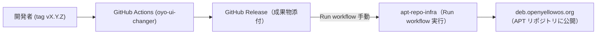

# oyo-ui-changer

`oyo-ui-changer` は、**GNOME の外観（UI）プリセットをワンクリックで適用**するためのユーティリティ（Debian パッケージ）です。  
`dconf` を用いて各種 GNOME Shell 拡張機能の設定・有効化を行い、**oYo Original / Windows Style / Mac Style** の 3 プロファイルを切り替えます。  
UI 選択には `zenity` を使用した簡易 GUI を提供します。

---

## リポジトリ構成

- `debian/` : Debian パッケージのメタデータ  
- `usr/bin/oyo-ui-changer` : 実行スクリプト本体  
- `.github/workflows/release.yml` : CI/CD ワークフロー定義  

---

## クライアントPCからの取得方法

oYoのリポジトリからインストール可能です。

```bash
sudo apt update
sudo apt install oyo-ui-changer
```

---

## 使い方

### GUIで適用
```bash
# GUI で UI を選択して適用
oyo-ui-changer
```
- ダイアログで UI を選択 → OK で適用  
- 成功メッセージを `zenity --info` で表示  

### CLIで直接指定
```bash
# GUI を使わずに直接適用
oyo-ui-changer oYo-original
oyo-ui-changer windows
oyo-ui-changer mac
```

---

## 依存関係

- ランタイム: `bash`, `dconf`, `zenity`
- GNOME Shell 拡張:
  - `arcmenu@arcmenu.com`
  - `dash-to-panel@jderose9.github.com`
  - `dash-to-dock@micxgx.gmail.com`
  - `add-to-desktop@tommimon.github.com`
  - `ding@rastersoft.com`
  - `kimpanel@kde.org`

> これらの拡張が未インストールの場合、設定適用に失敗します。

---

## 仕組みと設定方法（管理者向け）

- `dconf` コマンドを使って GNOME Shell の設定を切り替えています。  
- `dash-to-dock` などの GNOME 拡張機能を有効/無効にして UI を変更します。  

---

## CI/CD の仕組み（開発者向け）

`oyo-ui-changer` の開発では GitHub Actions を利用した CI/CD を導入しています。  
修正内容を push → tag を付与 → GitHub Actions で自動ビルド → `apt-repo-infra` でリポジトリ公開、という流れです。 



### フロー概要

1. **ソースコード修正**
   ```bash
   git clone https://github.com/openyellowos/oyo-ui-changer.git
   cd oyo-ui-changer
   ```

2. **プログラム修正**
   - `bin/oyo-ui-changer` を編集する。  
   - 必要があれば README.md も修正する。  

3. **changelog 更新**
   ```bash
   debchange -i
   ```
   - changelog に修正内容を記入する。

   例:
   ```text
   oyo-ui-changer (1.1-1) unstable; urgency=medium

     * dash-to-dock 設定変更の不具合を修正
     * README.md の利用方法を更新

    -- 開発者名 <you@example.com>  Sat, 31 Aug 2025 20:00:00 +0900
   ```

4. **コミット & push**
   ```bash
   git add .
   git commit -m "修正内容を記述"
   git push origin main
   ```

5. **タグ付与**
   ```bash
   git tag v1.1-1
   git push origin v1.1-1
   ```

6. **GitHub Actions による自動ビルド**
   - タグ push を検知してワークフローが起動。  
   - `.deb` がビルドされ、GitHub Release に添付される。  

7. **APT リポジトリ公開**
   - `apt-repo-infra` の GitHub Actions を **手動で Run workflow** する。  
   - 実際の入力例：  
     - Source repo: `openyellowos/oyo-ui-changer`  
     - Release tag: `v1.1-1`  
     - Target environment: `production`  

   - 実行すると apt リポジトリに反映される。  
   - 利用者は以下で最新を取得可能：  
     ```bash
     sudo apt update
     sudo apt install oyo-ui-changer
     ```

---

## 開発環境に必要なパッケージ & ローカルでビルドする手順

### 必要なツールのインストール
```bash
sudo apt update
sudo apt install -y devscripts build-essential debhelper lintian
```

### deb-src を有効にする
1. `/etc/apt/sources.list` を編集します。
   ```bash
   sudo nano /etc/apt/sources.list
   ```
2. 以下のような行を探し、コメントアウトを解除してください。
   ```text
   deb http://deb.debian.org/debian trixie main contrib non-free-firmware
   # deb-src http://deb.debian.org/debian trixie main contrib non-free-firmware
   ```
   ↓ 変更後
   ```text
   deb-src http://deb.debian.org/debian trixie main contrib non-free-firmware
   ```
3. 保存して終了後、更新します。
   ```bash
   sudo apt update
   ```

### ビルド依存の導入
```bash
sudo apt-get build-dep -y ./
```

### ローカルビルド
```bash
# 署名なしでバイナリのみビルド
dpkg-buildpackage -us -uc -b
# または（同等）
debuild -us -uc -b
```
- 生成物: `../oyo-ui-changer_*_amd64.deb`（親ディレクトリに出力）  

### テストインストール / アンインストール
```bash
sudo apt install ./../oyo-ui-changer_*_amd64.deb
# 動作確認後に削除する場合
sudo apt remove oyo-ui-changer
```

### クリーン
```bash
# パッケージの生成物を削除
fakeroot debian/rules clean
# もしくは
dpkg-buildpackage -T clean
```

---

### 注意事項

- **必ず changelog を更新すること**  
- **バージョン番号は changelog, git tag, GitHub Release を揃えること**  
- **依存関係変更時は debian/control を更新すること**  
